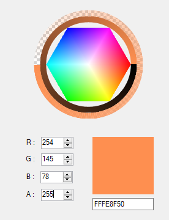

# coconut
A simple color picker lib for C# Winforms

*Warning: This is a project I originally started in September 2019 while I was still a .net novice and haven't touched it for more than 1 year. It may contain beginner mistakes and poor implementations. Any related issues will be fixed later.*

    </img>        

